# Pushmail-Center Benachrichtigungssystem - Vollständiger Implementierungsplan

## Übersicht
Implementierung eines umfassenden, programm-übergreifenden Benachrichtigungssystems im Pushmail-Center mit automatischen Alarmen, Quittierungsfunktion und zentraler Verwaltung.

---

## Benachrichtigungstypen nach Programm

### 1. Termin finden
- **Umfrage zugewiesen**: Benachrichtigung wenn eine Umfrage zugewiesen wurde
- **X Tage vor Ablauf**: Erinnerung X Tage vor Ablauf der Umfrage (Standard: 3 Tage)
- **Termin feststeht**: Benachrichtigung wenn ein Termin festgelegt wurde
- **Terminänderung**: Benachrichtigung bei Änderung eines Termins

### 2. Zahlungsverwaltung
- **Eingehende Teilungsanfrage**: Benachrichtigung bei neuer offener Teilungsanfrage
- **Antwort auf Teilungsanfrage**: Benachrichtigung wenn auf eigene Anfrage geantwortet wurde (Angenommen/Abgelehnt)

### 3. Ticket Support
- **Neues Ticket zugewiesen**: Benachrichtigung bei Ticket-Zuweisung
- **X Tage vor Fälligkeit**: Erinnerung X Tage vor Fälligkeitsdatum (Standard: 2 Tage)

### 4. Wertguthaben
- **X Tage vor Einlösefrist**: Erinnerung vor Ablauf der Einlösefrist (Standard: 7 Tage)
- **X Tage vor Ablaufdatum Code**: Erinnerung vor Code-Ablauf (Standard: 14 Tage)
- **X Tage vor Warnung**: Basierend auf "Warnung vor Ablauf (Tage)" Feld (Standard: 30 Tage)
- **X Tage vor Gültig ab** (nur Aktionscode): Erinnerung vor Aktivierung (Standard: 1 Tag)
- **X Tage vor Gültig bis** (nur Aktionscode): Erinnerung vor Ablauf (Standard: 7 Tage)

### 5. Lizenzen
- **X Tage vor Ablauftag**: Erinnerung vor Lizenzablauf (Standard: 14 Tage)

### 6. Vertragsverwaltung
- **X Tage vor Vertragsbeginn**: Erinnerung vor Vertragsstart (Standard: 7 Tage)
- **X Tage vor Vertragsende**: Erinnerung vor Vertragsende (Standard: 30 Tage)
- **X Tage vor Kündigungsdatum**: Erinnerung unter Berücksichtigung der Kündigungsfrist (Standard: 14 Tage)
- **X Tage vor Erinnerung & Notizen**: Basierend auf benutzerdefinierter Erinnerung (Standard: Wert aus Notiz)

### 7. Haushaltszahlungen
- **Status nicht okay**: Benachrichtigung wenn Status-Prüfung fehlschlägt
- **X Tage vor Gültig AB**: Erinnerung vor Startdatum (Standard: 3 Tage)
- **X Tage vor Gültig BIS**: Erinnerung vor Enddatum (Standard: 7 Tage)
- **X Tage vor Erinnerung**: Basierend auf Erinnerungsfeld (Standard: 5 Tage)

---

## Datenstruktur

### Benachrichtigungseinstellungen pro Benutzer
```
artifacts/{appId}/users/{userId}/pushmail_settings
{
  globalEnabled: boolean,
  programs: {
    TERMINPLANER: {
      enabled: boolean,
      notifications: {
        umfrage_zugewiesen: {
          state: "active" | "paused" | "disabled",
          time: "08:00",
          repeatDays: 0,
          daysBeforeX: null,
          customTitle: "Neue Umfrage zugewiesen",
          customMessage: "Du wurdest zu einer Umfrage eingeladen: {umfrageName}"
        },
        x_tage_vor_ablauf: {
          state: "active",
          time: "09:00",
          repeatDays: 1,
          daysBeforeX: 3,
          customTitle: "Umfrage läuft bald ab",
          customMessage: "Die Umfrage {umfrageName} läuft in {daysLeft} Tagen ab"
        },
        termin_feststeht: { ... },
        termin_geaendert: { ... }
      }
    },
    ZAHLUNGSVERWALTUNG: { ... },
    TICKET_SUPPORT: { ... },
    WERTGUTHABEN: { ... },
    LIZENZEN: { ... },
    VERTRAGSVERWALTUNG: { ... },
    HAUSHALTSZAHLUNGEN: { ... }
  }
}
```

### Ausstehende Benachrichtigungen
```
artifacts/{appId}/users/{userId}/pushmail_pending_notifications/{notificationId}
{
  programId: "TERMINPLANER",
  notificationType: "umfrage_zugewiesen",
  title: "Neue Umfrage zugewiesen",
  message: "Du wurdest zu einer Umfrage eingeladen: Weihnachtsfeier",
  createdAt: timestamp,
  scheduledFor: timestamp,
  lastSentAt: timestamp | null,
  nextSendAt: timestamp,
  repeatDays: 0,
  acknowledged: boolean,
  acknowledgedAt: timestamp | null,
  relatedDataId: "umfrageId123",
  relatedDataPath: "artifacts/{appId}/public/data/votes/umfrageId123"
}
```

### Quittierte Benachrichtigungen (Archiv)
```
artifacts/{appId}/users/{userId}/pushmail_acknowledged_notifications/{notificationId}
{
  ... (gleiche Struktur wie pending)
  acknowledgedAt: timestamp,
  acknowledgedBy: userId
}
```

---

## UI-Komponenten

### 1. Pushmail-Center View - Benachrichtigungseinstellungen

#### Globaler Toggle
```html
<div class="card bg-white p-4 rounded-xl shadow-lg border-t-4 border-fuchsia-600">
  <div class="flex items-center justify-between">
    <div>
      <h3 class="text-lg font-bold text-gray-800">Automatische Benachrichtigungen</h3>
      <p class="text-sm text-gray-600">Zentrale Steuerung aller Alarme</p>
    </div>
    <label class="flex items-center gap-2">
      <input type="checkbox" id="pushmailGlobalToggle" class="h-5 w-5">
      <span class="font-semibold">Global AN/AUS</span>
    </label>
  </div>
</div>
```

#### Programm-spezifische Einstellungen
```html
<div class="space-y-4">
  <!-- Für jedes Programm -->
  <div class="card bg-white p-4 rounded-xl shadow-lg border-l-4 border-cyan-500">
    <div class="flex items-center justify-between mb-3">
      <h4 class="font-bold text-cyan-600">Termin finden</h4>
      <label class="flex items-center gap-2">
        <input type="checkbox" class="program-toggle h-4 w-4" data-program="TERMINPLANER">
        <span class="text-sm">AN</span>
      </label>
    </div>
    
    <!-- Benachrichtigungen für dieses Programm -->
    <div class="space-y-3 pl-4 border-l-2 border-gray-200">
      
      <!-- Einzelne Benachrichtigung -->
      <div class="notification-item p-3 bg-gray-50 rounded-lg">
        <div class="flex items-start justify-between mb-2">
          <div class="flex-grow">
            <div class="font-semibold text-gray-800">Umfrage zugewiesen</div>
            <div class="text-xs text-gray-500">Benachrichtigung wenn eine Umfrage zugewiesen wurde</div>
          </div>
          <select class="notification-state-select text-xs p-1 border rounded" data-notification="umfrage_zugewiesen">
            <option value="active">Aktiv</option>
            <option value="paused">Pausiert</option>
            <option value="disabled">Deaktiviert</option>
          </select>
        </div>
        
        <div class="grid grid-cols-2 gap-2 mb-2">
          <div>
            <label class="text-xs text-gray-600">Uhrzeit</label>
            <input type="time" value="08:00" class="w-full text-xs p-1 border rounded">
          </div>
          <div>
            <label class="text-xs text-gray-600">Wiederholen (Tage)</label>
            <input type="number" value="0" min="0" class="w-full text-xs p-1 border rounded">
          </div>
        </div>
        
        <button class="text-xs text-blue-600 hover:underline" data-action="customize">
          ✏️ Text anpassen
        </button>
        <button class="text-xs text-gray-600 hover:underline ml-2" data-action="reset">
          🔄 Standard wiederherstellen
        </button>
      </div>
      
      <!-- Benachrichtigung mit X Tage -->
      <div class="notification-item p-3 bg-gray-50 rounded-lg">
        <div class="flex items-start justify-between mb-2">
          <div class="flex-grow">
            <div class="font-semibold text-gray-800">X Tage vor Ablauf</div>
            <div class="text-xs text-gray-500">Erinnerung vor Umfrage-Ablauf</div>
          </div>
          <select class="notification-state-select text-xs p-1 border rounded">
            <option value="active">Aktiv</option>
            <option value="paused">Pausiert</option>
            <option value="disabled">Deaktiviert</option>
          </select>
        </div>
        
        <div class="grid grid-cols-3 gap-2 mb-2">
          <div>
            <label class="text-xs text-gray-600">Tage vorher</label>
            <input type="number" value="3" min="0" class="w-full text-xs p-1 border rounded">
          </div>
          <div>
            <label class="text-xs text-gray-600">Uhrzeit</label>
            <input type="time" value="09:00" class="w-full text-xs p-1 border rounded">
          </div>
          <div>
            <label class="text-xs text-gray-600">Wiederholen</label>
            <input type="number" value="1" min="0" class="w-full text-xs p-1 border rounded">
          </div>
        </div>
        
        <button class="text-xs text-blue-600 hover:underline">✏️ Text anpassen</button>
        <button class="text-xs text-gray-600 hover:underline ml-2">🔄 Standard</button>
      </div>
      
    </div>
  </div>
</div>

<button id="savePushmailSettingsBtn" class="w-full py-3 bg-fuchsia-600 text-white font-bold rounded-lg">
  Einstellungen speichern
</button>
```

#### Text-Anpassungs-Modal
```html
<div id="customizeNotificationModal" class="modal">
  <div class="modal-content">
    <h3>Benachrichtigungstext anpassen</h3>
    
    <div class="mb-4">
      <label>Titel</label>
      <input type="text" id="customNotificationTitle" class="w-full p-2 border rounded">
    </div>
    
    <div class="mb-4">
      <label>Nachricht</label>
      <textarea id="customNotificationMessage" rows="4" class="w-full p-2 border rounded"></textarea>
      <p class="text-xs text-gray-500 mt-1">
        Verfügbare Platzhalter: {umfrageName}, {daysLeft}, {termin}, etc.
      </p>
    </div>
    
    <div class="flex gap-2">
      <button id="saveCustomNotificationBtn" class="flex-1 bg-green-600 text-white py-2 rounded">Speichern</button>
      <button id="cancelCustomNotificationBtn" class="flex-1 bg-gray-200 py-2 rounded">Abbrechen</button>
    </div>
  </div>
</div>
```

### 2. Startseite - Quittierungs-Modal

```html
<div id="pendingNotificationsModal" class="fixed inset-0 bg-black bg-opacity-50 flex items-center justify-center p-4 z-50">
  <div class="bg-white p-6 rounded-xl shadow-2xl w-full max-w-2xl max-h-[80vh] flex flex-col">
    <div class="flex justify-between items-center mb-4 border-b pb-3">
      <h3 class="text-xl font-bold text-red-600">⚠️ Ausstehende Benachrichtigungen</h3>
      <button id="closePendingNotificationsModal" class="text-gray-400 hover:text-red-600 text-2xl">&times;</button>
    </div>
    
    <div class="text-sm text-gray-600 mb-4">
      Bitte quittieren Sie die folgenden Benachrichtigungen, um sie zu bestätigen.
    </div>
    
    <div id="pendingNotificationsList" class="flex-grow overflow-y-auto space-y-3 mb-4">
      <!-- Einzelne Benachrichtigung -->
      <div class="p-3 border-l-4 border-red-500 bg-red-50 rounded">
        <label class="flex items-start gap-3 cursor-pointer">
          <input type="checkbox" class="acknowledge-checkbox h-5 w-5 mt-1" data-notification-id="notif123">
          <div class="flex-grow">
            <div class="font-bold text-gray-800">Umfrage läuft bald ab</div>
            <div class="text-sm text-gray-600 mt-1">Die Umfrage "Weihnachtsfeier" läuft in 3 Tagen ab</div>
            <div class="text-xs text-gray-400 mt-1">Programm: Termin finden | Erstellt: 21.01.2026 08:00</div>
          </div>
        </label>
      </div>
    </div>
    
    <div class="flex gap-3 border-t pt-3">
      <button id="acknowledgeSelectedBtn" class="flex-1 py-2 bg-green-600 text-white font-bold rounded-lg">
        Ausgewählte quittieren
      </button>
      <button id="acknowledgeAllBtn" class="flex-1 py-2 bg-blue-600 text-white font-bold rounded-lg">
        Alle quittieren
      </button>
    </div>
  </div>
</div>
```

### 3. Pushmail-Center View - Ausstehende Benachrichtigungen

```html
<div class="card bg-white p-4 rounded-xl shadow-lg border-t-4 border-red-600">
  <div class="flex justify-between items-center mb-3">
    <h3 class="text-lg font-bold text-gray-800">Ausstehende Benachrichtigungen</h3>
    <span id="pendingNotificationsCount" class="px-3 py-1 bg-red-600 text-white font-bold rounded-full text-sm">0</span>
  </div>
  
  <div id="pushmailPendingNotificationsList" class="space-y-2">
    <!-- Benachrichtigung mit Pulsieren -->
    <div class="p-3 border-l-4 border-red-500 bg-red-50 rounded animate-pulse">
      <div class="flex items-start justify-between">
        <div class="flex-grow">
          <div class="font-bold text-gray-800">Umfrage läuft bald ab</div>
          <div class="text-sm text-gray-600">Die Umfrage "Weihnachtsfeier" läuft in 3 Tagen ab</div>
          <div class="text-xs text-gray-400 mt-1">Termin finden | 21.01.2026 08:00</div>
        </div>
        <button class="acknowledge-notification-btn px-3 py-1 bg-green-600 text-white text-xs font-bold rounded hover:bg-green-700" data-notification-id="notif123">
          Quittieren
        </button>
      </div>
    </div>
  </div>
</div>
```

---

## Technische Implementierung

### Standard-Benachrichtigungsdefinitionen

```javascript
const NOTIFICATION_DEFINITIONS = {
  TERMINPLANER: {
    title: "Termin finden",
    color: "cyan",
    borderClass: "border-cyan-500",
    textClass: "text-cyan-600",
    notifications: {
      umfrage_zugewiesen: {
        label: "Umfrage zugewiesen",
        description: "Benachrichtigung wenn eine Umfrage zugewiesen wurde",
        defaultTitle: "Neue Umfrage zugewiesen",
        defaultMessage: "Du wurdest zu einer Umfrage eingeladen: {umfrageName}",
        defaultTime: "08:00",
        defaultRepeatDays: 0,
        daysBeforeX: null,
        placeholders: ["umfrageName", "ersteller"]
      },
      x_tage_vor_ablauf: {
        label: "X Tage vor Ablauf",
        description: "Erinnerung vor Umfrage-Ablauf",
        defaultTitle: "Umfrage läuft bald ab",
        defaultMessage: "Die Umfrage {umfrageName} läuft in {daysLeft} Tagen ab",
        defaultTime: "09:00",
        defaultRepeatDays: 1,
        defaultDaysBeforeX: 3,
        placeholders: ["umfrageName", "daysLeft", "ablaufDatum"]
      },
      termin_feststeht: {
        label: "Termin feststeht",
        description: "Benachrichtigung wenn ein Termin festgelegt wurde",
        defaultTitle: "Termin wurde festgelegt",
        defaultMessage: "Für {umfrageName} wurde ein Termin festgelegt: {termin}",
        defaultTime: "10:00",
        defaultRepeatDays: 0,
        daysBeforeX: null,
        placeholders: ["umfrageName", "termin"]
      },
      termin_geaendert: {
        label: "Terminänderung",
        description: "Benachrichtigung bei Terminänderung",
        defaultTitle: "Termin wurde geändert",
        defaultMessage: "Der Termin für {umfrageName} wurde geändert: {neuerTermin}",
        defaultTime: "10:00",
        defaultRepeatDays: 0,
        daysBeforeX: null,
        placeholders: ["umfrageName", "neuerTermin", "alterTermin"]
      }
    }
  },
  
  ZAHLUNGSVERWALTUNG: {
    title: "Zahlungsverwaltung",
    color: "emerald",
    borderClass: "border-emerald-600",
    textClass: "text-emerald-700",
    notifications: {
      teilungsanfrage_eingehend: {
        label: "Eingehende Teilungsanfrage",
        description: "Benachrichtigung bei neuer Teilungsanfrage",
        defaultTitle: "Neue Teilungsanfrage",
        defaultMessage: "{absender} möchte {betrag}€ mit dir teilen: {grund}",
        defaultTime: "08:00",
        defaultRepeatDays: 0,
        daysBeforeX: null,
        placeholders: ["absender", "betrag", "grund"]
      },
      teilungsanfrage_antwort: {
        label: "Antwort auf Teilungsanfrage",
        description: "Benachrichtigung bei Antwort auf eigene Anfrage",
        defaultTitle: "Antwort auf Teilungsanfrage",
        defaultMessage: "{empfaenger} hat deine Teilungsanfrage {status}: {betrag}€",
        defaultTime: "08:00",
        defaultRepeatDays: 0,
        daysBeforeX: null,
        placeholders: ["empfaenger", "status", "betrag", "grund"]
      }
    }
  },
  
  TICKET_SUPPORT: {
    title: "Ticket Support",
    color: "purple",
    borderClass: "border-purple-600",
    textClass: "text-purple-700",
    notifications: {
      ticket_zugewiesen: {
        label: "Neues Ticket zugewiesen",
        description: "Benachrichtigung bei Ticket-Zuweisung",
        defaultTitle: "Neues Ticket zugewiesen",
        defaultMessage: "Dir wurde ein Ticket zugewiesen: {ticketTitel}",
        defaultTime: "08:00",
        defaultRepeatDays: 0,
        daysBeforeX: null,
        placeholders: ["ticketTitel", "ersteller", "prioritaet"]
      },
      x_tage_vor_faelligkeit: {
        label: "X Tage vor Fälligkeit",
        description: "Erinnerung vor Fälligkeitsdatum",
        defaultTitle: "Ticket wird bald fällig",
        defaultMessage: "Das Ticket {ticketTitel} wird in {daysLeft} Tagen fällig",
        defaultTime: "09:00",
        defaultRepeatDays: 1,
        defaultDaysBeforeX: 2,
        placeholders: ["ticketTitel", "daysLeft", "faelligkeitsDatum"]
      }
    }
  },
  
  WERTGUTHABEN: {
    title: "Wertguthaben",
    color: "emerald",
    borderClass: "border-emerald-600",
    textClass: "text-emerald-700",
    notifications: {
      x_tage_vor_einloesefrist: {
        label: "X Tage vor Einlösefrist",
        description: "Erinnerung vor Ablauf der Einlösefrist",
        defaultTitle: "Gutschein läuft bald ab",
        defaultMessage: "Der Gutschein {gutscheinName} läuft in {daysLeft} Tagen ab",
        defaultTime: "10:00",
        defaultRepeatDays: 3,
        defaultDaysBeforeX: 7,
        placeholders: ["gutscheinName", "daysLeft", "ablaufDatum", "wert"]
      },
      x_tage_vor_ablauf_code: {
        label: "X Tage vor Ablaufdatum Code",
        description: "Erinnerung vor Code-Ablauf",
        defaultTitle: "Code läuft bald ab",
        defaultMessage: "Der Code für {gutscheinName} läuft in {daysLeft} Tagen ab",
        defaultTime: "10:00",
        defaultRepeatDays: 7,
        defaultDaysBeforeX: 14,
        placeholders: ["gutscheinName", "daysLeft", "ablaufDatum"]
      },
      x_tage_vor_warnung: {
        label: "X Tage vor Warnung",
        description: "Basierend auf Warnung vor Ablauf Feld",
        defaultTitle: "Gutschein-Warnung",
        defaultMessage: "Warnung für {gutscheinName}: {daysLeft} Tage bis Ablauf",
        defaultTime: "10:00",
        defaultRepeatDays: 7,
        defaultDaysBeforeX: 30,
        placeholders: ["gutscheinName", "daysLeft"]
      },
      x_tage_vor_gueltig_ab: {
        label: "X Tage vor Gültig ab (Aktionscode)",
        description: "Erinnerung vor Aktivierung (nur Aktionscode)",
        defaultTitle: "Aktionscode wird bald gültig",
        defaultMessage: "Der Aktionscode {gutscheinName} wird in {daysLeft} Tagen gültig",
        defaultTime: "08:00",
        defaultRepeatDays: 0,
        defaultDaysBeforeX: 1,
        placeholders: ["gutscheinName", "daysLeft", "gueltigAb"],
        condition: "type === 'Aktionscode'"
      },
      x_tage_vor_gueltig_bis: {
        label: "X Tage vor Gültig bis (Aktionscode)",
        description: "Erinnerung vor Ablauf (nur Aktionscode)",
        defaultTitle: "Aktionscode läuft bald ab",
        defaultMessage: "Der Aktionscode {gutscheinName} läuft in {daysLeft} Tagen ab",
        defaultTime: "10:00",
        defaultRepeatDays: 3,
        defaultDaysBeforeX: 7,
        placeholders: ["gutscheinName", "daysLeft", "gueltigBis"],
        condition: "type === 'Aktionscode'"
      }
    }
  },
  
  LIZENZEN: {
    title: "Lizenzen",
    color: "yellow",
    borderClass: "border-yellow-600",
    textClass: "text-yellow-700",
    notifications: {
      x_tage_vor_ablauf: {
        label: "X Tage vor Ablauftag",
        description: "Erinnerung vor Lizenzablauf",
        defaultTitle: "Lizenz läuft bald ab",
        defaultMessage: "Die Lizenz {lizenzName} läuft in {daysLeft} Tagen ab",
        defaultTime: "10:00",
        defaultRepeatDays: 7,
        defaultDaysBeforeX: 14,
        placeholders: ["lizenzName", "daysLeft", "ablaufDatum", "anbieter"]
      }
    }
  },
  
  VERTRAGSVERWALTUNG: {
    title: "Vertragsverwaltung",
    color: "indigo",
    borderClass: "border-indigo-600",
    textClass: "text-indigo-700",
    notifications: {
      x_tage_vor_vertragsbeginn: {
        label: "X Tage vor Vertragsbeginn",
        description: "Erinnerung vor Vertragsstart",
        defaultTitle: "Vertrag beginnt bald",
        defaultMessage: "Der Vertrag {vertragsName} beginnt in {daysLeft} Tagen",
        defaultTime: "09:00",
        defaultRepeatDays: 0,
        defaultDaysBeforeX: 7,
        placeholders: ["vertragsName", "daysLeft", "beginn", "anbieter"]
      },
      x_tage_vor_vertragsende: {
        label: "X Tage vor Vertragsende",
        description: "Erinnerung vor Vertragsende",
        defaultTitle: "Vertrag endet bald",
        defaultMessage: "Der Vertrag {vertragsName} endet in {daysLeft} Tagen",
        defaultTime: "10:00",
        defaultRepeatDays: 7,
        defaultDaysBeforeX: 30,
        placeholders: ["vertragsName", "daysLeft", "ende"]
      },
      x_tage_vor_kuendigung: {
        label: "X Tage vor Kündigungsdatum",
        description: "Erinnerung unter Berücksichtigung der Kündigungsfrist",
        defaultTitle: "Kündigungsfrist läuft bald ab",
        defaultMessage: "Kündigungsfrist für {vertragsName} endet in {daysLeft} Tagen (Kündigungsdatum: {kuendigungsDatum})",
        defaultTime: "10:00",
        defaultRepeatDays: 7,
        defaultDaysBeforeX: 14,
        placeholders: ["vertragsName", "daysLeft", "kuendigungsDatum", "kuendigungsFrist"]
      },
      x_tage_vor_erinnerung: {
        label: "X Tage vor Erinnerung & Notizen",
        description: "Basierend auf benutzerdefinierter Erinnerung",
        defaultTitle: "Vertrags-Erinnerung",
        defaultMessage: "Erinnerung für {vertragsName}: {erinnerungsText}",
        defaultTime: "10:00",
        defaultRepeatDays: 0,
        defaultDaysBeforeX: 0,
        placeholders: ["vertragsName", "erinnerungsText", "daysLeft"]
      }
    }
  },
  
  HAUSHALTSZAHLUNGEN: {
    title: "Haushaltszahlungen",
    color: "cyan",
    borderClass: "border-cyan-600",
    textClass: "text-cyan-700",
    notifications: {
      status_nicht_okay: {
        label: "Status nicht okay",
        description: "Benachrichtigung wenn Status-Prüfung fehlschlägt",
        defaultTitle: "Haushaltszahlungen: Problem erkannt",
        defaultMessage: "Es gibt ein Problem bei den Haushaltszahlungen: {problem}",
        defaultTime: "08:00",
        defaultRepeatDays: 1,
        daysBeforeX: null,
        placeholders: ["problem", "details"]
      },
      x_tage_vor_gueltig_ab: {
        label: "X Tage vor Gültig AB",
        description: "Erinnerung vor Startdatum",
        defaultTitle: "Haushaltszahlung beginnt bald",
        defaultMessage: "Die Zahlung {zahlungName} beginnt in {daysLeft} Tagen",
        defaultTime: "09:00",
        defaultRepeatDays: 0,
        defaultDaysBeforeX: 3,
        placeholders: ["zahlungName", "daysLeft", "gueltigAb"]
      },
      x_tage_vor_gueltig_bis: {
        label: "X Tage vor Gültig BIS",
        description: "Erinnerung vor Enddatum",
        defaultTitle: "Haushaltszahlung endet bald",
        defaultMessage: "Die Zahlung {zahlungName} endet in {daysLeft} Tagen",
        defaultTime: "10:00",
        defaultRepeatDays: 3,
        defaultDaysBeforeX: 7,
        placeholders: ["zahlungName", "daysLeft", "gueltigBis"]
      },
      x_tage_vor_erinnerung: {
        label: "X Tage vor Erinnerung",
        description: "Basierend auf Erinnerungsfeld",
        defaultTitle: "Haushaltszahlungs-Erinnerung",
        defaultMessage: "Erinnerung für {zahlungName}: {erinnerungsText}",
        defaultTime: "10:00",
        defaultRepeatDays: 0,
        defaultDaysBeforeX: 5,
        placeholders: ["zahlungName", "erinnerungsText", "daysLeft"]
      }
    }
  }
};
```

### Kern-Funktionen

#### 1. Einstellungen laden und speichern

```javascript
async function loadPushmailNotificationSettings(userId) {
  const docRef = doc(db, 'artifacts', appId, 'users', userId, 'pushmail_settings');
  const docSnap = await getDoc(docRef);
  
  if (!docSnap.exists()) {
    return getDefaultPushmailSettings();
  }
  
  return normalizePushmailSettings(docSnap.data());
}

async function savePushmailNotificationSettings(userId, settings) {
  const docRef = doc(db, 'artifacts', appId, 'users', userId, 'pushmail_settings');
  await setDoc(docRef, {
    ...settings,
    updatedAt: serverTimestamp()
  });
}

function getDefaultPushmailSettings() {
  const settings = {
    globalEnabled: true,
    programs: {}
  };
  
  Object.keys(NOTIFICATION_DEFINITIONS).forEach(programId => {
    const program = NOTIFICATION_DEFINITIONS[programId];
    settings.programs[programId] = {
      enabled: true,
      notifications: {}
    };
    
    Object.keys(program.notifications).forEach(notifId => {
      const notif = program.notifications[notifId];
      settings.programs[programId].notifications[notifId] = {
        state: "active",
        time: notif.defaultTime,
        repeatDays: notif.defaultRepeatDays,
        daysBeforeX: notif.defaultDaysBeforeX || null,
        customTitle: notif.defaultTitle,
        customMessage: notif.defaultMessage
      };
    });
  });
  
  return settings;
}
```

#### 2. Benachrichtigungen erstellen

```javascript
async function createPendingNotification(userId, programId, notificationType, relatedData) {
  const settings = await loadPushmailNotificationSettings(userId);
  const notifSettings = settings.programs[programId]?.notifications[notificationType];
  
  if (!notifSettings || notifSettings.state === 'disabled') {
    console.log('Benachrichtigung deaktiviert:', programId, notificationType);
    return;
  }
  
  const definition = NOTIFICATION_DEFINITIONS[programId].notifications[notificationType];
  
  // Platzhalter ersetzen
  const title = replacePlaceholders(notifSettings.customTitle, relatedData);
  const message = replacePlaceholders(notifSettings.customMessage, relatedData);
  
  // Zeitpunkt berechnen
  const scheduledFor = calculateScheduledTime(notifSettings.time, notifSettings.daysBeforeX, relatedData.targetDate);
  
  const colRef = collection(db, 'artifacts', appId, 'users', userId, 'pushmail_pending_notifications');
  await addDoc(colRef, {
    programId,
    notificationType,
    title,
    message,
    createdAt: serverTimestamp(),
    scheduledFor,
    lastSentAt: null,
    nextSendAt: scheduledFor,
    repeatDays: notifSettings.repeatDays,
    acknowledged: false,
    acknowledgedAt: null,
    relatedDataId: relatedData.id,
    relatedDataPath: relatedData.path
  });
}

function replacePlaceholders(text, data) {
  let result = text;
  Object.keys(data).forEach(key => {
    result = result.replace(new RegExp(`\\{${key}\\}`, 'g'), data[key]);
  });
  return result;
}

function calculateScheduledTime(timeString, daysBeforeX, targetDate) {
  const [hours, minutes] = timeString.split(':').map(Number);
  const scheduled = new Date(targetDate);
  
  if (daysBeforeX !== null) {
    scheduled.setDate(scheduled.getDate() - daysBeforeX);
  }
  
  scheduled.setHours(hours, minutes, 0, 0);
  return scheduled;
}
```

#### 3. Ausstehende Benachrichtigungen laden

```javascript
async function loadPendingNotifications(userId) {
  const colRef = collection(db, 'artifacts', appId, 'users', userId, 'pushmail_pending_notifications');
  const q = query(colRef, where('acknowledged', '==', false));
  const snapshot = await getDocs(q);
  
  return snapshot.docs.map(doc => ({
    id: doc.id,
    ...doc.data()
  }));
}

async function renderPendingNotifications() {
  const userId = currentUser.mode;
  const notifications = await loadPendingNotifications(userId);
  
  const list = document.getElementById('pushmailPendingNotificationsList');
  const count = document.getElementById('pendingNotificationsCount');
  
  if (count) count.textContent = notifications.length;
  
  if (notifications.length === 0) {
    list.innerHTML = '<p class="text-sm text-gray-400 text-center">Keine ausstehenden Benachrichtigungen</p>';
    return;
  }
  
  list.innerHTML = notifications.map(notif => {
    const program = NOTIFICATION_DEFINITIONS[notif.programId];
    return `
      <div class="p-3 border-l-4 ${program.borderClass} bg-${program.color}-50 rounded animate-pulse">
        <div class="flex items-start justify-between">
          <div class="flex-grow">
            <div class="font-bold text-gray-800">${notif.title}</div>
            <div class="text-sm text-gray-600">${notif.message}</div>
            <div class="text-xs text-gray-400 mt-1">
              ${program.title} | ${formatDate(notif.createdAt)}
            </div>
          </div>
          <button class="acknowledge-notification-btn px-3 py-1 bg-green-600 text-white text-xs font-bold rounded hover:bg-green-700" 
                  data-notification-id="${notif.id}">
            Quittieren
          </button>
        </div>
      </div>
    `;
  }).join('');
}
```

#### 4. Benachrichtigungen quittieren

```javascript
async function acknowledgeNotification(userId, notificationId) {
  const docRef = doc(db, 'artifacts', appId, 'users', userId, 'pushmail_pending_notifications', notificationId);
  await updateDoc(docRef, {
    acknowledged: true,
    acknowledgedAt: serverTimestamp()
  });
  
  // Optional: In Archiv verschieben
  const docSnap = await getDoc(docRef);
  if (docSnap.exists()) {
    const archiveRef = doc(db, 'artifacts', appId, 'users', userId, 'pushmail_acknowledged_notifications', notificationId);
    await setDoc(archiveRef, docSnap.data());
    await deleteDoc(docRef);
  }
}

async function acknowledgeMultipleNotifications(userId, notificationIds) {
  const batch = writeBatch(db);
  
  notificationIds.forEach(id => {
    const docRef = doc(db, 'artifacts', appId, 'users', userId, 'pushmail_pending_notifications', id);
    batch.update(docRef, {
      acknowledged: true,
      acknowledgedAt: serverTimestamp()
    });
  });
  
  await batch.commit();
}
```

#### 5. Startseiten-Modal automatisch öffnen

```javascript
async function checkAndShowPendingNotificationsModal() {
  const userId = currentUser.mode;
  if (!userId || userId === GUEST_MODE) return;
  
  const notifications = await loadPendingNotifications(userId);
  
  if (notifications.length > 0) {
    showPendingNotificationsModal(notifications);
  }
}

function showPendingNotificationsModal(notifications) {
  const modal = document.getElementById('pendingNotificationsModal');
  const list = document.getElementById('pendingNotificationsList');
  
  list.innerHTML = notifications.map(notif => {
    const program = NOTIFICATION_DEFINITIONS[notif.programId];
    return `
      <div class="p-3 border-l-4 ${program.borderClass} bg-${program.color}-50 rounded">
        <label class="flex items-start gap-3 cursor-pointer">
          <input type="checkbox" class="acknowledge-checkbox h-5 w-5 mt-1" data-notification-id="${notif.id}">
          <div class="flex-grow">
            <div class="font-bold text-gray-800">${notif.title}</div>
            <div class="text-sm text-gray-600 mt-1">${notif.message}</div>
            <div class="text-xs text-gray-400 mt-1">
              Programm: ${program.title} | Erstellt: ${formatDate(notif.createdAt)}
            </div>
          </div>
        </label>
      </div>
    `;
  }).join('');
  
  modal.classList.remove('hidden');
  modal.classList.add('flex');
}
```

#### 6. Benachrichtigungs-Scheduler (Background Job)

```javascript
// Diese Funktion sollte regelmäßig aufgerufen werden (z.B. alle 5 Minuten)
async function checkAndSendScheduledNotifications() {
  const now = new Date();
  
  // Alle Benutzer durchgehen (oder nur aktuelle Benutzer)
  const userId = currentUser.mode;
  if (!userId || userId === GUEST_MODE) return;
  
  const colRef = collection(db, 'artifacts', appId, 'users', userId, 'pushmail_pending_notifications');
  const q = query(colRef, 
    where('acknowledged', '==', false),
    where('nextSendAt', '<=', now)
  );
  
  const snapshot = await getDocs(q);
  
  for (const docSnap of snapshot.docs) {
    const notif = docSnap.data();
    
    // Pushover-Nachricht senden
    await sendPushoverNotification(userId, notif.title, notif.message);
    
    // Nächsten Sendezeitpunkt berechnen
    if (notif.repeatDays > 0) {
      const nextSend = new Date(notif.nextSendAt.toDate());
      nextSend.setDate(nextSend.getDate() + notif.repeatDays);
      
      await updateDoc(docSnap.ref, {
        lastSentAt: serverTimestamp(),
        nextSendAt: nextSend
      });
    } else {
      // Einmalige Benachrichtigung - als gesendet markieren
      await updateDoc(docSnap.ref, {
        lastSentAt: serverTimestamp(),
        nextSendAt: null
      });
    }
  }
}

async function sendPushoverNotification(userId, title, message) {
  // User-Key aus Pushmail-Center laden
  const cfgRef = doc(db, 'artifacts', appId, 'public', 'data', 'pushover_programs', userId);
  const cfgSnap = await getDoc(cfgRef);
  
  if (!cfgSnap.exists()) {
    console.warn('Kein User-Key für Benutzer:', userId);
    return;
  }
  
  const userKey = cfgSnap.data().userKey;
  const apiToken = cfgSnap.data().apiToken;
  
  // Pushover API aufrufen
  const response = await fetch('https://api.pushover.net/1/messages.json', {
    method: 'POST',
    headers: { 'Content-Type': 'application/json' },
    body: JSON.stringify({
      token: apiToken,
      user: userKey,
      title: title,
      message: message
    })
  });
  
  if (!response.ok) {
    console.error('Pushover-Fehler:', await response.text());
  }
}
```

---

## Implementierungsschritte

### Phase 1: Datenstruktur und Definitionen
1. Benachrichtigungsdefinitionen für alle Programme erstellen
2. Standard-Einstellungen definieren
3. Firestore-Struktur für Einstellungen und ausstehende Benachrichtigungen

### Phase 2: Einstellungs-UI im Pushmail-Center
1. Globalen Toggle implementieren
2. Programm-Liste mit Benachrichtigungen rendern
3. Einzelne Benachrichtigungseinstellungen (State, Zeit, Wiederholung, Tage)
4. Text-Anpassungs-Modal implementieren
5. Standard-Wiederherstellungs-Funktion
6. Speichern-Funktion

### Phase 3: Benachrichtigungs-Erstellung
1. Funktionen zum Erstellen von Benachrichtigungen in jedem Programm
2. Trigger-Punkte identifizieren (z.B. neue Umfrage, Ticket zugewiesen)
3. Integration in bestehende Programme

### Phase 4: Quittierungs-System
1. Startseiten-Modal für ausstehende Benachrichtigungen
2. Automatisches Öffnen beim Laden der Seite
3. Quittierungs-Funktion (einzeln und mehrfach)
4. Anzeige im Pushmail-Center mit Pulsieren
5. Quittierungs-Button im Pushmail-Center

### Phase 5: Scheduler und Versand
1. Background-Job für Benachrichtigungs-Prüfung
2. Pushover-Integration
3. Wiederholungs-Logik
4. Fehlerbehandlung

### Phase 6: Integration in Programme
1. **Terminplaner**: Trigger bei Umfrage-Zuweisung, Ablauf, Termin-Festlegung, Änderung
2. **Zahlungsverwaltung**: Trigger bei Teilungsanfragen und Antworten
3. **Ticket Support**: Trigger bei Zuweisung und Fälligkeit
4. **Wertguthaben**: Trigger für alle Ablaufdaten
5. **Lizenzen**: Trigger für Ablaufdatum
6. **Vertragsverwaltung**: Trigger für alle Vertragsdaten
7. **Haushaltszahlungen**: Trigger für Status und Daten

---

## Dateien die erstellt/geändert werden müssen

### Neue Dateien
1. **pushmail-notifications.js** - Kern-Logik für Benachrichtigungssystem
2. **pushmail-scheduler.js** - Background-Job für Benachrichtigungs-Versand

### Zu ändernde Dateien
1. **index.html** - UI-Komponenten hinzufügen
2. **style.css** - Styling für Benachrichtigungen
3. **haupteingang.js** - Integration und Initialisierung
4. **terminplaner.js** - Trigger-Punkte hinzufügen
5. **zahlungsverwaltung.js** - Trigger-Punkte hinzufügen
6. **ticket-support.js** - Trigger-Punkte hinzufügen
7. **wertguthaben.js** - Trigger-Punkte hinzufügen
8. **lizenzen.js** - Trigger-Punkte hinzufügen
9. **vertragsverwaltung.js** - Trigger-Punkte hinzufügen
10. **haushaltszahlungen.js** - Trigger-Punkte hinzufügen
11. **firestore.rules** - Zugriffsregeln für Benachrichtigungen

---

## Mermaid-Diagramm: Benachrichtigungsfluss

```mermaid
graph TD
    A[Ereignis in Programm] --> B{Benachrichtigung aktiviert?}
    B -->|Ja| C[Benachrichtigung erstellen]
    B -->|Nein| Z[Ende]
    C --> D[In pending_notifications speichern]
    D --> E[Scheduler prüft regelmäßig]
    E --> F{Zeitpunkt erreicht?}
    F -->|Nein| E
    F -->|Ja| G[Pushover-Nachricht senden]
    G --> H{Wiederholung aktiviert?}
    H -->|Ja| I[Nächsten Sendezeitpunkt berechnen]
    H -->|Nein| J[Als gesendet markieren]
    I --> E
    J --> K[Benutzer öffnet App]
    K --> L[Modal mit ausstehenden Benachrichtigungen]
    L --> M[Benutzer quittiert]
    M --> N[In acknowledged_notifications verschieben]
    N --> Z
```



---

## Wichtige Hinweise

1. **Erweiterbarkeit**: Das System ist so konzipiert, dass neue Programme und Benachrichtigungstypen einfach hinzugefügt werden können
2. **Performance**: Benachrichtigungen sollten gecacht werden, um Firestore-Abfragen zu minimieren
3. **Sicherheit**: Firestore-Regeln müssen sicherstellen, dass Benutzer nur ihre eigenen Benachrichtigungen sehen/ändern können
4. **Scheduler**: Der Background-Job sollte als Service Worker oder regelmäßiger Check implementiert werden
5. **Platzhalter**: Jedes Programm muss die korrekten Daten für Platzhalter bereitstellen

---

## Nächste Schritte

1. Bestätigung des Plans durch Benutzer
2. Wechsel in Code-Modus
3. Schrittweise Implementierung nach Phasen
4. Testing nach jeder Phase
5. Integration in bestehende Programme
